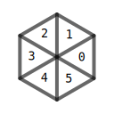

# HexFlowNative
## Math
### [math_type.h](/HexFlowNative/Main/math_type.h)
基础数据类型和数学运算函数. 兼容 Unity 中的 Vector 系列类型. 目前仅包含二维和三维的定义.
- vector2_template\<T> 二维向量的模板类定义, 包含 vector2f 和 vector2i 的实现.
- vector3_template\<T> 三维向量的模板类定义, 包含 vector3f 和 vector3i 的实现.

### [hex_math.h](/HexFlowNative/Main/hex_math.h)
六边形网格的数学运算函数. 其中参数类型都引用自 [math_type.h](#math_typeh).
大部分算法来自 [Hexagonal Grids](https://www.redblobgames.com/grids/hexagons)(后续简称 **HexGrids**), 本文中缺失的说明和细节可以参考该网站. 下面将简单介绍作为 API 用户需要掌握的基本概念.
#### 网格点坐标计算
六边形网格数学运算函数主要解决坐标转换问题. 常规的笛卡尔直角坐标系显然无法直接用于构建六边形网格. HexGrids 中介绍了三种能表示六边形网格格点的坐标系统, 分别为 Offset, Cube 和 Axial. 

- Offset 坐标为二维向量, 便于紧密存储数据. hex_math 中使用 oddr 格式的坐标 ([Offset坐标的四种类型](https://www.redblobgames.com/grids/hexagons/#coordinates-offset)).
- Cube 坐标为三维向量, 可以用于几何运算. 三个分量满足约束 x+y+z = 0
- Axial 坐标 Cube 坐标的前两维, 通过上述约束可以直接转化为 Cube 坐标.

实际上在 HexGrids 中还提到一种 Doubled 坐标系统, 但由于没有发现这种坐标的实际应用上的优势, 因此并没有采用这种表示法.

在 hex 中定义了一系列 xxx 2 xxx (xxx to xxx)的转换函数, 可以在三种坐标系统中任意转换.
#### 非网格点坐标计算
由于 Axial 坐标与笛卡尔直角坐标系可以直接线性变换, 因此在几何运算时具有显著的优势. 提供了两个核心转换函数:

## Mesh
网格体相关, 主要是是各类网格的生成和调整
### [mesh_generator.h](/HexFlowNative/Main/mesh_generator.h)
提供多种六边形网格的生成算法, 不涉及内存分配.

目前有下列变体:
| 函数名 | 网格分布 | 顶点数/单元格 | 说明 |
| - | :-: | - | - |
| gen_rect_layout_a |  | 18 | 六个正三角形组成, 逆时针排列 |
| gen_rect_layout_b |  | 12 | 一个大三角形+三个扁三角形组成 |

两种变体都可以使用下图表示的纹理:

正三角形用中间部分, 扁的等腰三角形用右侧部分. 左侧扁三角形是为了图像的完整性, 保证交点附近的像素的对称.

函数的参数中包含若干个指针, 函数的实现假设指针指向的内存空间恰好分配了需要的长度. 由于实际生成的顶点数需要计算, 因此额外提供了形如 `calc_num_of_rect_layout_x` 的函数, 用于计算总顶点数. 未来扩展新的六边形网格时, 也会提供对应的顶点数计算函数.